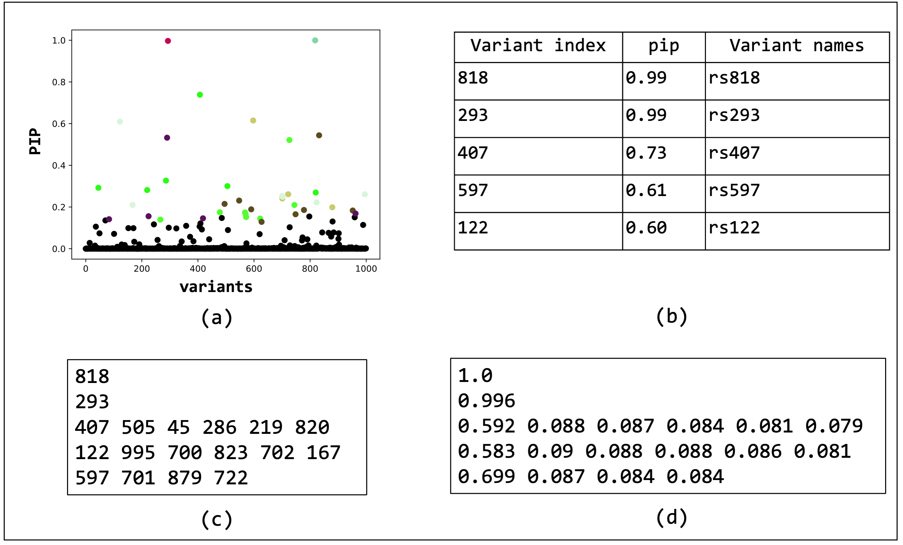

# [BEATRICE: Bayesian Fine-mapping from Summary Data using Deep Variational Inference](https://biorxiv.org/cgi/content/short/2023.03.24.534116v1)

In this repository, we introduce BEATRICE, a finemapping tool to identify putative causal variants from GWAS summary data. BEATRICE combines a hierarchical Bayesian model with a deep learning-based inference procedure. This combination provides greater inferential power to handle noise and spurious interactions due to polygenicity of the trait, trans-interactions of variants, or varying correlation structure of the genomic region. 


Overview of BEATRICE. The inputs to our framework are the LD matrix  and the summary statistics. The inference module uses a neural network to estimate the underlying parameters. The random process generates random samples for the Monte Carlo integration. Finally, the generative module calculates the likelihood of the summary statistics from the sample causal vectors $\mathbf{c}^l$.

### Table of contents:

 - [Installation](#installation)
    - [Install using Singularity](#install-beatrice-using-singularity)
    - [Install using Anaconda](#install-beatrice-using-anaconda)
    - [Install using Python packages](#install-beatrice-using-python-packages)
 - [Usage](#usage)
    - [Using Container](#run-beatrice-using-singularity-container)
    - [Using Anaconda](#run-beatrice-using-anaconda-environment)
    - [Using Python](#run-beatrice-using-anaconda-environment)
 - [Outputs of BEATRICE](#description-of-the-output-files)
 - [Flags](#flags-of-beatrice)
 
 ## Installation
 
 ### Install BEATRICE Using Singularity
 We have uploaded the singularity container (.sif) to run BEATRICE. It is highly recommended to run BEATRICE inside the container. The container was built using [Singularity](https://docs.sylabs.io/guides/3.5/user-guide/introduction.html). Please follow the [installation steps](https://docs.sylabs.io/guides/3.0/user-guide/installation.html) to install singularity in your system. Once installed, you can pull the .sif file using the following command:
 ```
 singularity pull --arch amd64 library://sayan_ghosal/finemapping/beatrice.sif:latest
 ```
 The container contains all the dependencies to run BEATRICE. Once downloaded, refer to the section [Run BEATRICE Using Singularity Container](#run-beatrice-using-singularity-container) to learn about using BEATRICE.
 
 ### Install BEATRICE Using Anaconda
 We have uploaded the [anaconda](https://docs.anaconda.com/anaconda/install/index.html) environment file, [`conda_environment.yml`](https://github.com/sayangsep/Beatrice-Finemapping/blob/main/conda_environment.yml), listing all the dependencies required to run BEATRICE. The anaconda environment can be easily created by the following command:
 ```
 conda env create -f conda_environment.yml
 ```
 
 This will create an environment named, `beatrice_env`, which will have all the dependencies downloaded inside.  Once installed, refer to the section [Run BEATRICE Using Anaconda Environment](#run-beatrice-using-anaconda-environment) to learn about using BEATRICE using anaconda. However, please note that this environment file is created with Linux, so it might not work with other operating systems.
 
 ### Install BEATRICE Using Python packages
 
 The user can also run BEATRICE with their own personal installation of python packages. The packages required for running BEATRICE are listed below:
 
 - [PyTorch](https://pytorch.org/)
 - [Absl](https://anaconda.org/anaconda/absl-py)
 - [Matplotlib](https://matplotlib.org/stable/users/installing/index.html)
 - [Numpy](https://numpy.org/install/)
 - [Glob](https://pypi.org/project/glob2/)
 - [Pickle](https://anaconda.org/conda-forge/pickle5)
 - [Pandas](https://pandas.pydata.org/docs/getting_started/install.html)
 - [Seaborn](https://seaborn.pydata.org/installing.html)
 - [Imageio](https://imageio.readthedocs.io/en/v2.8.0/installation.html)
 - [Shutil](https://anaconda.org/conda-forge/pytest-shutil)
 
 ## Usage
 Download the github repo (https://github.com/sayangsep/Beatrice-Finemapping.git) to your local machine and goto that folder. 
 ### Run BEATRICE Using Singularity Container
 
Running BEATRICE requires three things, a 'space' separated file storing the z-scores, a 'space' separated file storing the LD matrix, and number of subjects used to run the GWAS. As an example, we have provided a file containing [the zcores](example_data/Simulation_data0.z) and [the LD matrix](example_data/Simulation_data0.ld). The zscores file should contain two columns; the first column is the name of the variants, and the second column is the z-scores. 
 
 Once the files are in the above-mentioned format you can run BEATRIC using singularity by taking the following steps:
  - Goto the folder where the github repo is downloaded.
 - Dowload [the singularity container](#install-beatrice-using-singularity) and move it inside the Beatrice-Finemapping folder.
 - Run BEATRICE as, 
 ```
 singularity run beatrice.sif python beatrice.py --z example_data/Simulation_data0.z --LD example_data/Simulation_data0.ld --N 5000 --target results
 ```
 While running on a different data replace the ```--z``` flag with ```--z {location to the z-file}```, and  the ```--LD``` flag with ```--LD {location to the LD file}```, the ```--N``` flag with ```--N {number of subjects}```, and the ```--target``` flag with ```--target {location to store results}```.
 
### Run BEATRICE Using Anaconda Environment
Running BEATRICE requires three things, a 'space' separated file storing the z-scores, a 'space' separated file storing the LD matrix, and the number of subjects used to run the GWAS. As an example, we have provided a file containing [the zcores](example_data/Simulation_data0.z) and [the LD matrix](example_data/Simulation_data0.ld). The z-scores file should contain two columns; the first column is the name of the variants, and the second column is the z-scores. 
 
 Once the files are in the above-mentioned format you can run BEATRIC using singularity by taking the following steps:
 - Goto the folder where the github repo is downloaded.
 
 - Install [the anaconda environment](#install-beatrice-using-anaconda) and start it as,
 ```
 conda activate beatrice_env
 ```
 - Run BEATRICE as, 
 ```
 python beatrice.py --z example_data/Simulation_data0.z --LD example_data/Simulation_data0.ld --N 5000  --target results
 ```
 While running on a different data replace the ```--z``` flag with ```--z {location to the z-file}```, and  the ```--LD``` flag with ```--LD {location to the LD file}```, the ```--N``` flag with ```--N {number of subjects}```, and the ```--target``` flag with ```--target {location to store results}```.
  
  ### Run BEATRICE Using Python Packages
 Running BEATRICE requires three things, a 'space' separated file storing the z-scores, a 'space' separated file storing the LD matrix, and the number of subjects used to run the GWAS. As an example, we have provided a file containing [the zcores](example_data/Simulation_data0.z) and [the LD matrix](example_data/Simulation_data0.ld). The zscores file should contain two columns; the first column is the name of the variants, and the second column is the z-scores. 
 
 Once the files are in the above-mentioned format you can run BEATRIC using singularity by taking the following steps:
 - Goto the folder where the github repo is downloaded.
 
 - Run BEATRICE as, 
 ```
 python beatrice.py --z example_data/Simulation_data0.z --LD example_data/Simulation_data0.ld --N 5000  --target results
 ```
 While running on a different data replace the ```--z``` flag with ```--z {location to the z-file}```, and  the ```--LD``` flag with ```--LD {location to the LD file}```, the ```--N``` flag with ```--N {number of subjects}```, and the ```--target``` flag with ```--target {location to store results}```.
 
 ## Description of the output files
 If the user has ran BEATRICE in the format described in the previous section, then it will create a ```results``` folder where the outputs will be stored.
 The output results in a pdf file displaying the PIPs and overlaying credible sets, a table with PIPs, a text file with credible sets, and a text file with the conditional inclusion probability of the variants within the credible sets.
 


 Overview of the outputs generated by BEATRICE. (a) The PIPs are displayed and color coded by their assignment to credible sets. (b) A table with the PIPs and the corresponding name of the variants. (c) A text file with the credible sets. Here each row represent a credible set and the entries are indices of the variants present in the credible set. The first column of each row represents the key index. (d) The conditional inclusion probability of each of the credible variants given the key variant.
 
 The user can also generate the neural network losses described in [the paper](https://biorxiv.org/cgi/content/short/2023.03.24.534116v1) by adding the following flag to the run command.
 ```
 singularity run beatrice.sif python beatrice.py --plot_loss True --z example_data/Simulation_data0.z --LD example_data/Simulation_data0.ld --N 5000 --target results
 ```
 ### Flags of BEATRICE
A brief description of the flags and their use for running BEATRICE.

Tha flags used in running BEATRICE can be found by one of the following commands:

 ```
 singularity run beatrice.sif python beatrice.py --help
 ```
 OR
  ```
 python beatrice.py --help
 ```

The following flags can be used to control the performance of BEATRICE:

- ```--z```: Location of Z Score (default: 'example_data/Simulation_data0.z').
- ```--LD```: Location of LD matrix (default: 'example_data/Simulation_data0.ld').
- ```--N```: Number of subjects (default: 5000).
- ```--n_causal```: Number of causal variants (default: 1).
- ```--gamma```: The $\gamma$ threshold creates the reduced space of binary vectors $B^R$ (default: 0.1).
- ```--gamma_coverage```: $\gamma_{coverage}$ controls the threshold for coverage (default: 0.95).
- ```--gamma_key```: $\gamma_{key}$ is the threshold for adding key variants (default: 0.2).
- ```--gamma_selection```: It controls the threshold to add variants to a credible set (default: 0.05).
- ```--MCMC_samples```: Number of random samples for MC integration (default: 1).
- ```--get_cred```: A flag to generate credible sets (default: 'true').
- ```--max_iter```: Number of training iterations (default: 2001).
- ```--plot_loss```: Plot neural network training losses (default: 'true').
- ```--prior_location```:Location to the file where prior probability is stored. The format should be same as the z-file, but instead of z-scores the second column should contain the prior probabilities (default: constant probability ($1/{NumberofVariants}$)).
 - ```--sigma_sq```: Variance of causal variants (default: 0.05).
 - ```--sparse_concrete```: Number of non zero locatons of the concrete random vector at every iteration (default: 50).
 - ```--target```: Location to store results (default: results).
 - ```--temp_lower_bound```: The temperature variable, $\lambda$, that controls the extent of continuous relaxations (default: 0.01).
 - ```--true_loc```: A comma separated list that contains the index of true causal variants (default: None).
 - ```--allow_dup```: Allow duplicate variants across credible sets (default: False).
